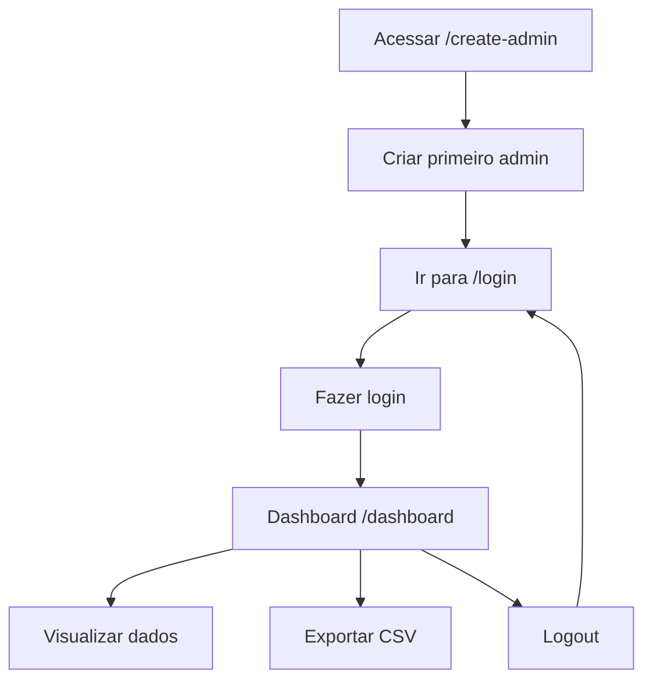

# 🚀 Sistema de Autenticação e Dashboard - Turvia

## 📋 Visão Geral

Sistema de login e dashboard administrativo para gerenciar contatos e leads da Turvia, integrado com Firebase Authentication e Firestore.

## 🔑 Funcionalidades

### Autenticação
- ✅ Login com email/senha
- ✅ Cadastro de novos usuários administrativos
- ✅ Proteção de rotas
- ✅ Logout automático
- ✅ Validação de formulários

### Dashboard
- 📊 Análise de leads em tempo real
- 📈 Gráficos de conversão
- 🔍 Filtros por período
- 💾 Exportação para CSV
- 👁️ Visualização detalhada de leads

## 🛠️ Configuração Inicial

### 1. Criar Primeiro Usuário Admin

**Acesse:** `/create-admin`

- Use esta página apenas uma vez para criar o primeiro usuário
- Email padrão: `admin@turvia.com`
- Defina uma senha forte (mínimo 6 caracteres)
- Anote as credenciais em local seguro

### 2. Login no Sistema

**Acesse:** `/login`

- Use as credenciais criadas no passo anterior
- Alterne entre "Entrar" e "Cadastrar" conforme necessário
- Após login, será redirecionado para `/dashboard`

### 3. Acessar Dashboard

**Acesse:** `/dashboard`

- Visualize estatísticas de leads
- Filtre por períodos (hoje, semana, mês, etc.)
- Exporte dados em CSV
- Faça logout quando necessário

## 🔗 Rotas Disponíveis

| Rota | Descrição | Proteção |
|------|-----------|----------|
| `/create-admin` | Criar primeiro usuário admin | Pública |
| `/login` | Login/Cadastro de usuários | Pública |
| `/dashboard` | Dashboard de contatos | Protegida |

## 🎯 Fluxo de Uso

## 🔒 Segurança

### Firebase Auth
- Senhas criptografadas automaticamente
- Validação de email obrigatória
- Tokens de sessão seguros
- Logout automático por inatividade

### Proteção de Rotas
- Middleware de autenticação
- Redirecionamento automático para login
- Verificação de estado de usuário

## 📱 Responsividade

- ✅ Desktop (1920px+)
- ✅ Tablet (768px - 1024px)
- ✅ Mobile (320px - 767px)

## 🎨 Interface

### Login/Cadastro
- Design moderno com gradientes
- Alternância entre modos via tabs
- Validação em tempo real
- Feedback visual de erros

### Dashboard
- Cards de métricas
- Gráfico de evolução temporal
- Tabela de leads paginada
- Modal de detalhes
- Botão de exportação

## ⚡ Performance

- Loading states em todas as operações
- Dados em tempo real via Firestore listeners
- Lazy loading de componentes
- Otimização de re-renders

## 🔧 Tecnologias

- **React 18** - Framework
- **React Router 6** - Roteamento
- **Firebase Auth** - Autenticação
- **Firestore** - Banco de dados
- **React Icons** - Ícones
- **CSS Modules** - Estilos

## 📊 Dados do Dashboard

### Métricas Principais
- **Total de Leads:** Todos os contatos
- **Novos Leads:** Últimas 24h
- **Em Contato:** Status ativo
- **Convertidos:** Leads fechados

### Filtros Disponíveis
- Hoje
- Última semana
- Último mês
- Último trimestre
- Último ano
- Todos os períodos

### Exportação CSV
Campos incluídos:
- Nome
- Email
- WhatsApp
- Tipo de plano
- Data de criação
- Status

## ⚠️ Observações Importantes

1. **Primeiro Acesso:** Use `/create-admin` apenas uma vez
2. **Credenciais:** Anote login/senha em local seguro
3. **Logout:** Sempre faça logout ao terminar
4. **Dados:** Dashboard atualiza em tempo real
5. **Export:** CSV baixado automaticamente no navegador

## 🆘 Troubleshooting

### Erro de Login
- Verifique email/senha
- Certifique-se que usuário foi criado
- Limpe cache do navegador

### Dashboard não carrega
- Verifique conexão com Firebase
- Confirme que está autenticado
- Recarregue a página

### Dados não aparecem
- Verifique coleção 'leads' no Firestore
- Confirme regras de segurança do Firebase
- Veja console do navegador para erros

---

**Sistema desenvolvido para Turvia** 🏖️
*Gestão inteligente para agências de turismo*
